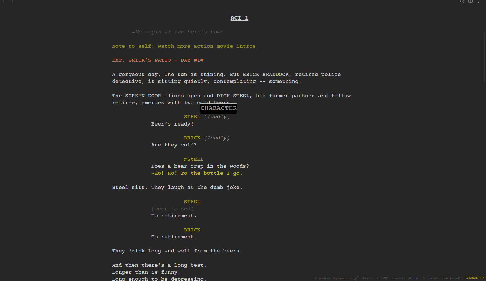
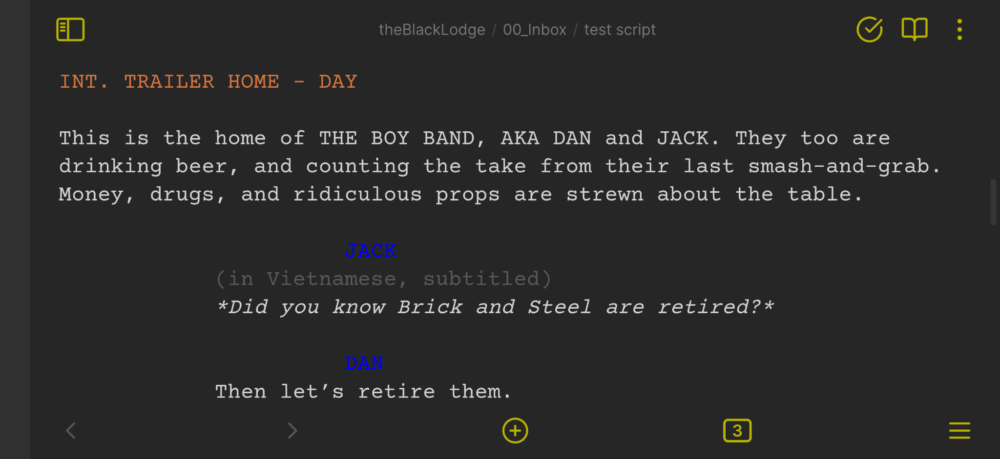
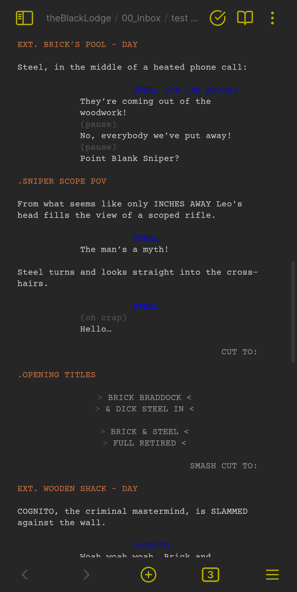

# Fountain Screenwriter for Obsidian

A powerful Obsidian screenwriting plugin powered by [Fountain-JS](https://fountain.io/): real-time syntax highlighting, classic virtual page formatting, dynamic indentation & colour themes, status-bar line-type read-outs, hover tooltips, and seamless desktop & mobile support.



---

## 🔥 Features

 **Fountain Support**  
Full support for [Fountain](https://fountain.io/) markup: scene headings, action, character, dialogue, parentheticals, transitions, lyrics, and more.

**Real-time Fountain syntax highlighting**
Instantly see Scene Headings, Action, Character Cues, Dialogue, Parentheticals, Transitions, Lyrics, Notes, and more in distinct colors.

**True “virtual page” formatting**
Your script adopts the classic 78-character page width, centered in the editor—just like Final Draft or Fade In.

**Responsive mobile support**
Portrait or landscape, your pages reflow gracefully on every screen. No more tiny fonts or clipped margins on your phone.





**Dynamic indentation toggle**
Switch between flush-left and screenplay-style margins on the fly. One click in the settings keeps you in “classic” or “modern” mode.

**Status-bar line-type read-out**
Always know which element you’re on—Scene Heading, Dialogue, Action, etc.—at a glance, in the bottom bar.

**Hover tooltips**
Hover over any line to see its type spelled out (e.g. DIALOGUE, CHARACTER), perfect for catching mis-tagged lines.

**Customizable colour themes**
Choose from built-in palettes or define your own accent colors for every script element.

**Desktop & Mobile-First**  
Lazy-loaded Node exports (PDF & FDX) on desktop; mobile-safe worker loader via Vault API; no unnecessary polyfills.

---

## 🚀 Installation
Open Obsidian’s `Settings` → `Community plugins` → `Browse`

Search for “Fountain Screenwriter” and click `Install`.


## 🎨 Configuration
Head to `Settings` → `Fountain Screenwriter` to tailor your experience:

- **Show Hover Hints**: Toggle the line-type tooltip.

- **Syntax Colours**: Turn colour-coding on or off.

- **Indentation**: Enable classic screenplay margins or flush-left.

- **Colour Overrides**: Pick your own color for Scene Headings, Dialogue, Transitions, and more.

## 📖 Usage
In any note, add YAML frontmatter:

```yaml
---
script: true
---
```

Start typing in Fountain syntax:

```fountain
INT. KITCHEN – DAY

MARY
(excited)
I can’t believe it’s finally happening!

Mary watches as her text instantly adopts screenplay styling in Obsidian—no extra commands needed.
```

## ❤️ Credits & Support
Built with ❤️ using `@thombruce/Fountain-JS` and Obsidian’s plugin API.
Find support, report issues, or contribute here on GitHub.

## 📜 License
Distributed under the GPL-3.0 license. See LICENSE for details.
